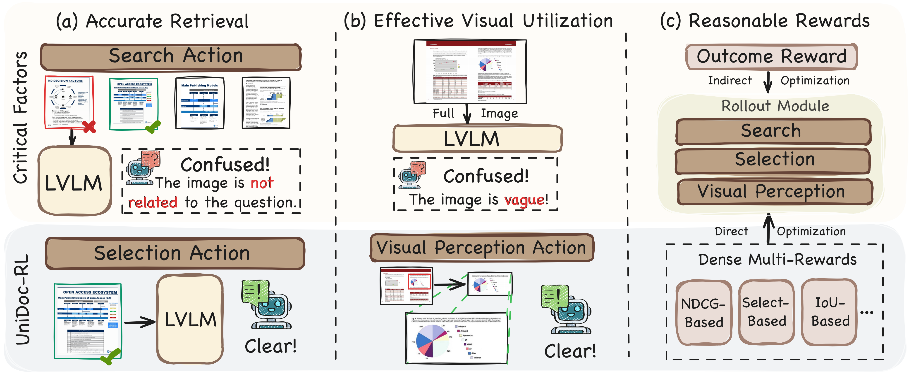
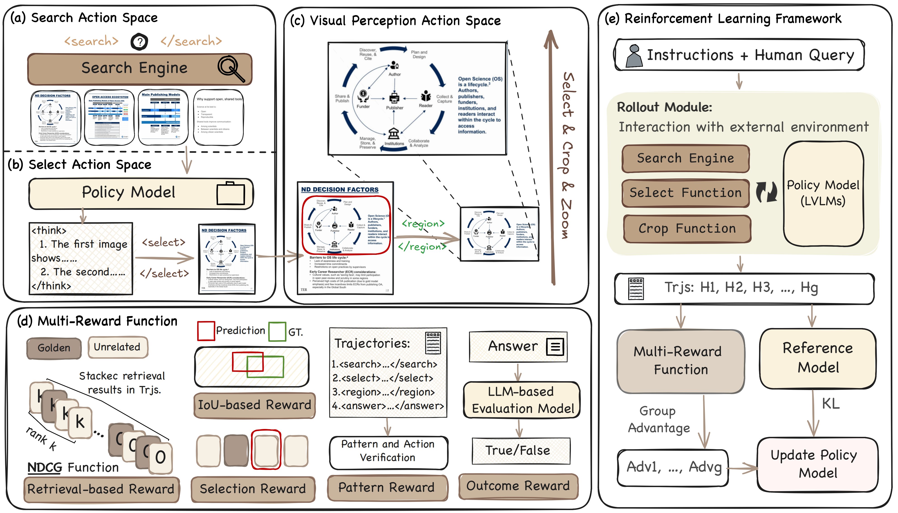
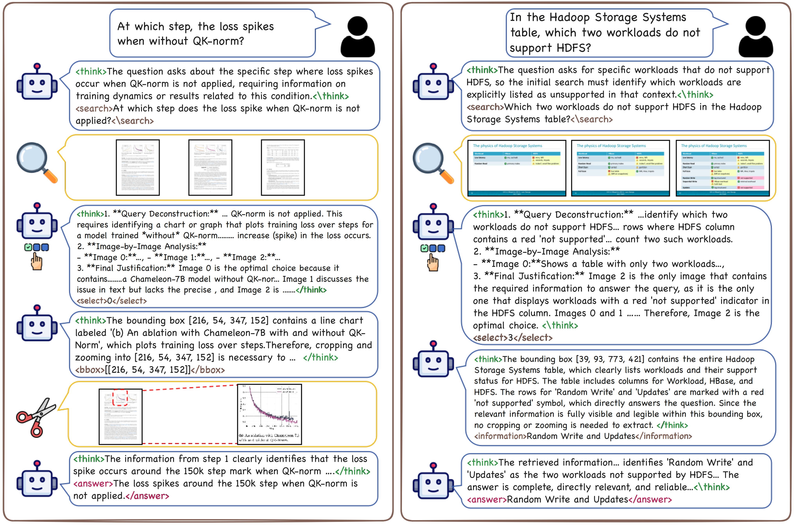

<div align="center">

# UniDoc-RL: Coarse-to-Fine Visual RAG with Hierarchical Actions and Dense Rewards

<p align="center">
  
</p>

</div>

## 🚀 Overview

- **UniDoc-RL** is a unified reinforcement learning framework for **visual document RAG**, where an LVLM agent jointly performs **retrieval, reranking, active visual perception, and reasoning** within a single decision process.
- It formulates visual evidence acquisition as a **hierarchical sequential decision-making problem**, progressively refining information from coarse document retrieval to fine-grained image selection and region cropping.
- To support this training paradigm, we build and release a **high-quality dataset** of multi-turn reasoning trajectories with fine-grained action annotations, and validate the framework through extensive experiments on three benchmarks.

In UniDoc-RL, the model interacts with an external environment through structured actions such as `<search>`, `<select>`, `<bbox>`, and `<answer>`. This design enables the agent to progressively gather evidence from coarse page-level retrieval to fine-grained region inspection, which is especially useful for charts, tables, dense text regions, and multi-page evidence aggregation.

<div align="center">
<p align="center">
  
</p>
</div>

We emphasize two key properties of UniDoc-RL: **progressive evidence acquisition** and **region-grounded interaction**. The agent first searches over page images, then selects the most informative visual evidence, and finally performs targeted crop-and-zoom operations when the answer depends on local fine-grained content.

<div align="center">
<p align="center">
  
</p>
</div>


## ⚙️ Train Model with UniDoc-RL

### Training Dependencies

```bash
conda create -n unidoc_rl python=3.10
conda activate unidoc_rl

git clone https://github.com/deepglint/UniDoc-RL.git
cd UniDoc-RL
```


### Step1. Prepare Data.

#### Benchmark & Training Data

First, download the training datasets used in the paper from their official release pages or project links. After downloading, reorganize all samples into a unified **JSON** format so they can be further converted for synthetic data generation.

Every sample should contain:
- a unique sample id,
- the user question,
- the reference answer,
- the document or page identifier,
- optional metadata such as page index, evidence type, and question type.

```json
{
  "uid": "sample_000001",
  "query": "What is the reported top-1 accuracy in the ablation study?",
  "reference_answer": "84.7%",
  "meta_info": {
    "file_name": "example_document",
    "reference_page": [12],
    "source_type": "Text/Table",
    "query_type": "Single-Hop"
  }
}
```

### Step2. Build Training Corpus & Run Multi-Modal Search Engine.

UniDoc-RL trains against a retrieval environment built on document page images. You should first convert each document into page-level images and organize them into a corpus directory.

Install the dependencies for the retrieval toolkit:

```bash
cd tools
pip install -r requirements.txt
```

Build the retrieval index:

```bash
cd tools/search_engine
python ingestion.py --dataset_dir /path/to/your/corpus
```

Then launch the search engine API:

```bash
cd tools/search_engine
SEARCH_DATASET_DIR=/path/to/your/corpus \
SEARCH_PORT=9001 \
python search_engine_api.py
```

By default, the retrieval module uses a ColQwen-style vision-language embedding backend and returns top-$k$ relevant page images for each search action.


### Step3. Construct High-quality CoT & Learn Patterns via SFT.

Before RL, UniDoc-RL supports constructing high-quality multi-turn trajectories with the synthetic data pipeline in `synthetic_data/`. This stage can generate search, rerank, crop, and answer traces that are useful for bootstrapping the model with supervised fine-tuning.

Install the dependencies for synthetic trajectory generation:

```bash
cd synthetic_data
pip install -r requirements.txt
```

Example command:

```bash
cd synthetic_data
python generate_cot_data.py \
  --data-path /path/to/data.json \
  --output-path /path/to/output.jsonl \
  --search-engine-url http://127.0.0.1:9001/search \
  --layout-parser-url http://127.0.0.1:30000 \
  --llm-engine-url http://127.0.0.1:9009/v1 \
  --vllm-engine-url http://127.0.0.1:9000/v1 \
  --enable-rerank \
  --enable-crop
```

To convert the generated JSONL trajectories into the open-source ShareGPT-style multimodal format expected by LLaMA-Factory:

```bash
cd synthetic_data
python convert_to_llamafactory.py \
  --input-path /path/to/output.jsonl \
  --output-path ../LLaMA-Factory/data/unidoc_sft.json
```

The generated trajectories can then be converted into chat-style training data for SFT. In our framework, this stage teaches the model the basic interaction pattern of:

- reasoning before acting,
- issuing retrieval queries when evidence is missing,
- selecting the most relevant page image,
- requesting region magnification only when needed,
- answering after sufficient evidence has been collected.

#### SFT with LLaMA-Factory

This repository already includes a local copy of [LLaMA-Factory](./LLaMA-Factory), which can be used to run multimodal SFT on the trajectories generated above.

First, install the LLaMA-Factory dependencies:

```bash
cd LLaMA-Factory
pip install -e ".[torch,metrics]" --no-build-isolation
```

The corresponding dataset entry has already been registered in `LLaMA-Factory/data/dataset_info.json` under the name `unidoc`, so in most cases you only need to prepare `unidoc_sft.json` with the `messages` and `images` fields.

For SFT with Qwen2.5-VL:

```bash
cd LLaMA-Factory
CUDA_VISIBLE_DEVICES=0,1,2,3,4,5,6,7 \
llamafactory-cli train examples/train_full/qwen2_5vl_full_sft.yaml
```

### Step4. Run RL Training with SFT Model.


#### Start Training

Install the dependencies for RL training:

```bash
cd RLTrain
pip install -r requirements.txt
```

If you use the model-based evaluator during training, start the evaluation service first:

```bash
cd tools/model_eval
pip install -r ../requirements.txt
EVAL_MODEL_NAME=Qwen/Qwen2.5-72B-Instruct \
EVAL_PORT=8003 \
python evaluator_api.py
```

Set the required environment variables:

```bash
export MODEL_PATH=/path/to/your/sft-checkpoint
export TRAIN_FILE=/path/to/your/train.parquet
export VAL_FILE=/path/to/your/val.parquet
export SEARCH_URL=http://127.0.0.1:9001/search
export RM_URL=http://127.0.0.1:8003/eval
```

Then start training:

```bash
cd RLTrain
bash train.sh
```

The default launcher configures GRPO-style RL optimization with multi-turn rollouts, multimodal prompts, external retrieval, and model-based reward evaluation.


## 🙏 Acknowledgements

This work is implemented based on and inspired by several open-source projects, including [VRAG-RL](https://github.com/Alibaba-NLP/VRAG/tree/main/VRAG-RL), [verl](https://github.com/volcengine/verl), and [LLaMA-Factory](https://github.com/hiyouga/LLaMA-Factory). We sincerely thank the authors and contributors of these projects for making their code and ideas publicly available.


## 📝 Citation

If you find this repository useful, please cite the corresponding paper. The bibliographic information can be updated once the public paper entry is finalized.

```bibtex
@misc{unidocrl2026,
      title={UniDoc-RL: Coarse-to-Fine Visual RAG with Hierarchical Actions and Dense Rewards},
      author={Author List To Be Updated},
      year={2026},
      note={Project page and paper link will be updated.}
}
```
